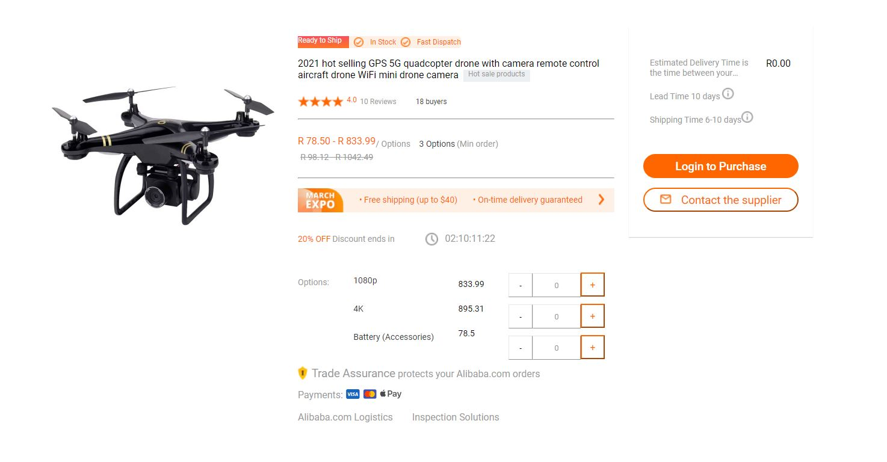

# Vaimo Assessment 2

Product detail page built with React(Next.js) and Redux.

# Instructions for compiling and running the code

1. Make sure you have **[Node](https://nodejs.org/en/)** Installed.
2. Clone repo
3. Go into project directory where repo was downloaded
4. **Run npm install** (This will install all dependencies)
5. Finally run **npm run dev**

# Brief overview

- This product detail page is made with Next.js (React). I picked Next.js for this project because it solved a problem that many web developers used to have with web applications rendered on the client-side (in the browser). All API calls are handled by the server before being sent to the user's browsers allowing for a smoother and faster interface. I am always learning new technologies if something better than Next.js came along I would learn it and try and implement it for a better user experience.

- Index.js in the directory of pages is where the site lives. API call is made in this page, which is then past down as props to the ProductFeed component.

- In ProductFeed component live other components for the inputs, buttons, live countdown timer **(npm i react-countdown)**

- Redux toolkit is used to handled state of all qty boxes. I used Redux to have one global store to call state and to avoid prop drilling

- React hooks with function based components are used

- useSelector, useDispatch, useState and useEffect are hooks that are used in this project

- Main content are located in the product feed component
